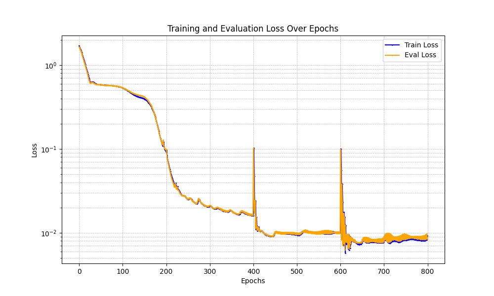
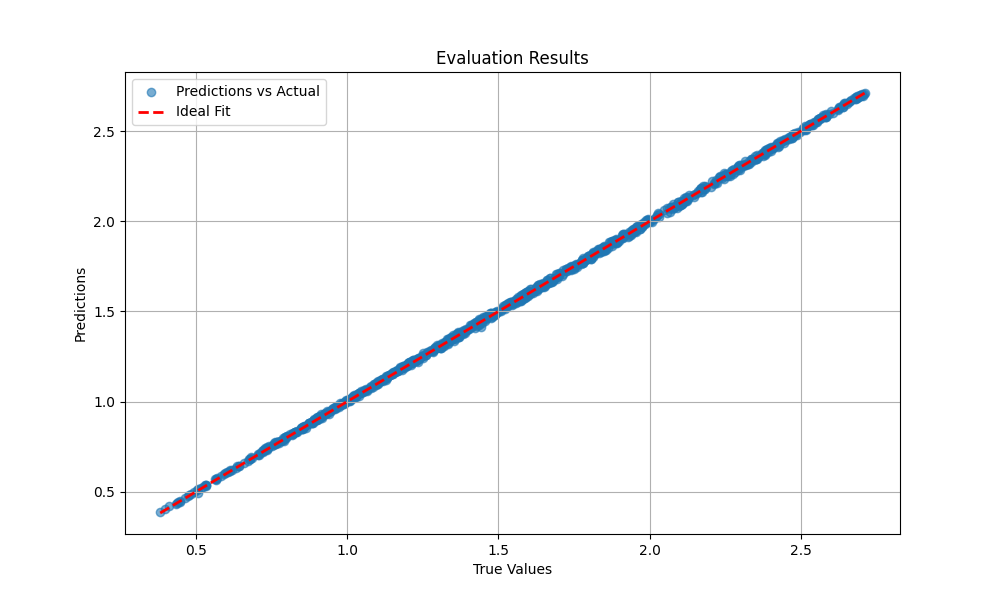

# jaxKAN

A JAX implementation of the original Kolmogorov-Arnold Networks (KANs), using the Flax and Optax frameworks for neural networks and optimization, respectively. Our adaptation is based on the original [pykan](https://github.com/KindXiaoming/pykan), however we also included a built-in grid extension routine, which does not simply perform an adaptation of the grid based on the inputs, but also extends its size.

## Why not more efficient?

Despite their overall potential in the Deep Learning field, the authors of KANs emphasized their performance when it comes to scientific computing, in tasks such as Symbolic Regression or solving PDEs. This is why we put emphasis on preserving their original form, albeit less computationally efficient, as it allows the user to utilize the full regularization terms presented in the [arXiv pre-print](https://arxiv.org/abs/2404.19756) and not the "mock" regularization terms presented, for instance, in the [efficient-kan](https://github.com/Blealtan/efficient-kan/tree/master) implementation.

## Why JAX?

Because speed + scientific computing. Need we say more? Plus, even though all tests were performed on CPU, in JAX it is more than straightforward to switch to GPU.

## General Information

The main codebase lies in the `src` directory, while an `.ipynb` notebook with documentation and comments can be found in `docs`. For a full example on how to use jaxKAN on a task also tackled by the authors of pykan, please visit the `tests` directory. Below you can see some results from this example.

*Figure 1: Loss Curves, depicting some pleateaus during grid extension, as in the original implementation. The spikes are due to the re-initialization of Adam, which is performed in a somewhat smooth manner in our implementation.*

*Figure 2: Comparison between ground truth and evaluated results for the task of learning a multivariate function with a [4,2,1,1] KAN.*

## Future Work

There are still many things to try out, for example different optimizers, hyper-parameter tuning, smoother initializations during extension, and so on. For now, this is a totally stable version, as showcased in the example task.
