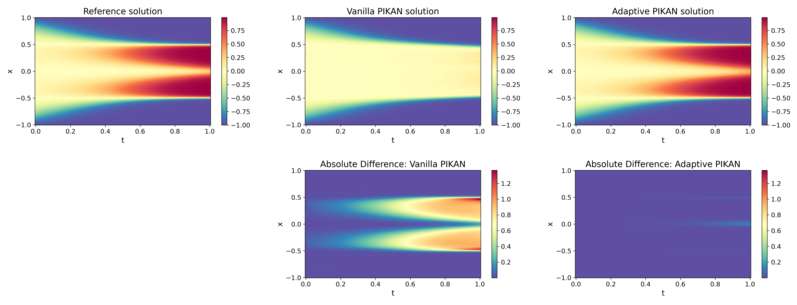

# Summary

`jaxKAN` is a JAX-based library for building and training Kolmogorov–Arnold Networks (KANs) [@Liu:2024],
built on Flax's NNX [@flax] with Optax [@optax] for optimization. It provides a broad selection of layer
implementations - from the original KAN design to more recent or efficient variants - and unifies them under
a single interface. Beyond basic model instance definition and training, `jaxKAN` supports class-inherent
adaptive training methods (e.g., grid updates) and provides utilities that address performance limitations in
the original KAN framework. KANs from `jaxKAN` can be used in any setting where standard multilayer perceptrons (MLPs)
would otherwise be employed as the underlying architecture, although the library includes specialized utilities
for adaptive Partial Differential Equation (PDE) solving tasks, thus placing emphasis on scientific applications
with Physics-Informed Kolmogorov-Arnold Networks (PIKANs) [@Karniadakis:2024].

# Statement of need

The recent introduction of KANs [@Liu:2024] in machine learning provided an alternative to traditional MLPs
by making the network activation functions trainable, through expansions in terms of basis functions - originally
B-splines. This novel idea proved to be effective across diverse applications, from engineering to scientific
computing. Consequently, KANs were extended to incorporate alternative basis functions, such as
polynomial [@Sidharth:2024] or trigonometric [@fkan] functions. Moreover, more efficient architectures were
proposed to overcome performance bottlenecks in the original design [@effkan]. As a result, a growing body of
research has explored new ways to build, refine and utilize KANs, yet a comprehensive, high-performance
software framework that integrates these ideas under one roof has been lacking.

Existing libraries only partially address this need. For instance, `pykan` [@pykan], the original
`PyTorch`-based [@paszke:2019] KAN implementation, does not provide expandability to multiple layer types.
Similarly, frameworks like `NeuroMANCER` [@neuromancer], while valuable for physics-informed applications,
restrict KAN usage mainly to scientific computing tasks via the use of high-level APIs, thus limiting their
applicability for other types of problems or low-level integration into novel deep learning architectures.
Additionally, while decentralized repositories exist for individual KAN layer types, there is no unified
approach to constructing and training KANs, making it challenging to combine them into hybrid architectures or
incorporate them into broader workflows. This fragmented landscape perpetuates the tendency towards assembling
custom, case-specific solutions by researchers and practitioners.

`jaxKAN` fills this gap by providing a JAX-native codebase that encompasses multiple KAN layer types, from the
original B-spline-based approach to alternative variants. Through its unified interface, users can not only 
choose from various basis expansions but also utilize built-in adaptive routines - such as grid updates,
adaptive state transitions, or basis order extension - to tackle problems where static representations
underperform. Moreover, it delivers specialized utilities for the adaptive training of PIKANs, a field where KANs
have proven to be equally or even more efficient than MLPs in several occasions [@Karniadakis:2024; @Rigas:2024].
At the time of writing, `jaxKAN` has been used in a series of academic works relevant to PDE
problems [@Howard1:2024; @Rigas:2024; @Howard2:2024; @Jacob:2024], and has showcased significantly
faster performance compared to the original `pykan` implementation [@Rigas:2024].

# Core Functionality

In the following, a brief discussion on the core functionality of `jaxKAN` is provided.

## Layer Selection

In `jaxKAN`, KANs are built as instances of the `KAN` class, which comprises one or more Kolmogorov–Arnold layers.
These layers are defined within the `jaxkan.layers` module, which currently includes five types:

- `base`: the original B-spline-based layer.

- `spline`: the efficient variant of the original B-spline-based layer [@effkan].

- `cheby`: a layer using Chebyshev polynomials.

- `mod-cheby`: a layer using Chebyshev polynomials without incorporating trigonometric functions for their calculation [@Karniadakis:2024].

- `fourier`: a layer utilizing sines and cosines as basis functions. 

While these cover the most commonly used basis functions, the library will remain under active development,
aiming to add further variants as research continues and identifies promising new options.

## Network Methods

Each KAN instance provides three primary methods: initialization for customizing layer parameters, a forward pass for
passing inputs through the network, and an `update_grids` method for in-place adjustments to each layer's grid.
Although grid updates are naturally interpreted in spline-based layers, they also extend to other types: for Chebyshev
layers, the method increases the degree of the polynomial basis functions, while in Fourier layers the method
adds more terms to the Fourier sums. Notably, this method requires a technique to solve batched least-squares
problems in parallel - an operation currently not supported natively by JAX libraries but implemented internally in
`jaxKAN` for optimal performance.

## PIKAN utilities

Beyond its low-level KAN functionality, `jaxKAN` supplies dedicated utilities for PIKANs. Users wishing to fine-tune
every detail can extend the `KAN` class to their own needs, as illustrated in the documentation's tutorials.
Alternatively, a higher-level `train_PIKAN` function automates the end-to-end adaptive training loop, allowing a PIKAN
to solve a forward PDE problem with minimal overhead.

# Case Study

As a case study, the Allen-Cahn equation, defined by

\begin{equation}\label{eq:AC}
\frac{\partial u}{\partial t} - D\frac{\partial^2 u}{\partial x^2} + 5 \left(u^3 - u\right) = 0,
\end{equation}

for $D = 10^{-3}$ in the $\Omega = [0,1]\times [-1, 1]$ domain, subject to the boundary conditions

$$ u\left(t=0, x\right) = x^2 \cos\left(\pi x\right), $$

$$ u\left(t, x=-1\right) = u\left(t, x=1\right) = -1, $$

is solved, by training a network of `spline` layers for $5\cdot 10^4$ epochs.

The reference solution to \autoref{eq:AC} is depicted in the upper row of \autoref{fig:AC}; since the Allen-Cahn
equation does not have an analytical solution, the reference solution used by @Wu:2022 is adopted herein.
The plots in the middle row of \autoref{fig:AC} depict two approximate solutions, corresponding to the results obtained
after training a vanilla PIKAN, i.e., a PIKAN trained without adopting adaptive techniques, (left) and an adaptively
trained PIKAN (right). Finally, the lower row of \autoref{fig:AC} showcases the absolute error corresponding to each
PIKAN's approximation, relative to the reference. This example highlights the benefits of adaptive training, as the
vanilla PIKAN fails to capture the details of the reference solution, especially in the $t \geq 0.3$ region.

# References
